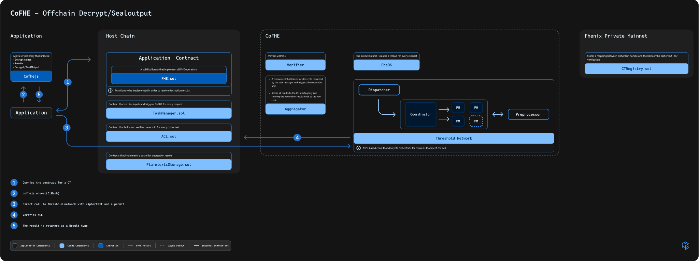

# Decrypt/SealOutput from FhenixJS

The following diagram illustrates the complete flow of an Decrypt/SealOutput request in the CoFHE ecosystem:

*Figure 1: End-to-end flow of an Decrypt/SealOutput request through the CoFHE system components*