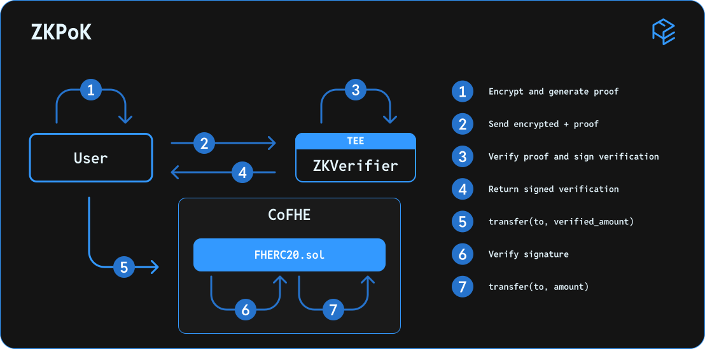

# ZK Verifier

**ZK-Verifier** is an essential component for encrypting and providing data as inputs to confidential smart contracts.

| Aspect               | Description                                                                                                                                                                     |
| -------------------- | ------------------------------------------------------------------------------------------------------------------------------------------------------------------------------- |
| **Type**             | Off-chain service, used by clients (like cofhe.js).                                                                                                                             |
| **Function**         | Verifies the user's input, ensuring that it is safe to use.                                                                                                                     |
| **Responsibilities** | • Receives a user's ZKPoK of their inputs. • Verifies said ZK proofs. • Generates a signature, allowing the user to use these inputs in a smart contract function call. |

## ZKPoK - Why?

**Zero-Knowledge Proof of Knowledge (ZKPoK)** provides a crucial security mechanism in CoFHE. It allows users to prove they know the plaintext of an encrypted input they're sending to a smart contract, without revealing the plaintext itself.

ZKPoKs protect against potential malicious vectors, including:

1. Malleability Attacks: Without ZKPoK protection, attackers could manipulate encrypted data by applying transformations to observed ciphertexts, even without knowing what's inside them. For example, they might combine existing ciphertexts with encrypted zero values to create new valid-looking encrypted data, potentially compromising user's confidentiality.
2. Chosen Ciphertext Attacks (CCAs): Attackers can submit modified ciphertexts to the system and observe the results, potentially exploiting homomorphic operations to infer sensitive information, manipulate data, or even recover the secret key.

Requiring a ZKPoK for each encrypted input helps running an encryption system in the public space that is a blockchain runtime. It ensures that only users with knowledge of the original plaintext can produce valid proofs. This approach eliminates multiple security risks, protecting sensitive user data and maintaining the system’s integrity.

## Sending encrypted inputs

As mentioned before, when providing ciphertexts as an input to a smart contract, users have to generate a ZKPoK and get a verification approval first. Although most of the work will be handled by cofhe.js and FHE.sol, we will describe the high level flow of this mechanism (also in the diagram above).
The users will encrypt an input(s) and generate a ZK proof of knowledge for it. Next, they will send the ciphertext(s) and proof(s) to the ZKVerifier, which will in turn verify the proof and sign a verification message.

The users can then send this ciphertext(s) and verification(s) as input(s) to a smart contract. The smart contract will first verify the ZKVerifier’s signature, and only if valid will allow the processing of the input(s).

## ZK-Verifier

The ZK-Verifier is a zk-verification program. It has two purposes:

1. Verify the ZKPoK’s of ciphertexts that are intended to be inputted to a CoFHE smart contract.
2. Sign a verification message, allowing the said contract to ensure that the inputs are safe and were validated.

The signed message that the ZK-Verifier outputs will then be verified by the receiving contract using `ecrecover`. That means that the ZKVerifier’s public key will be predetermined and well-known.

The ZKVerifier runs in a TEE to reduce trust and ensure the integrity of the inputs and signed verification messages.
